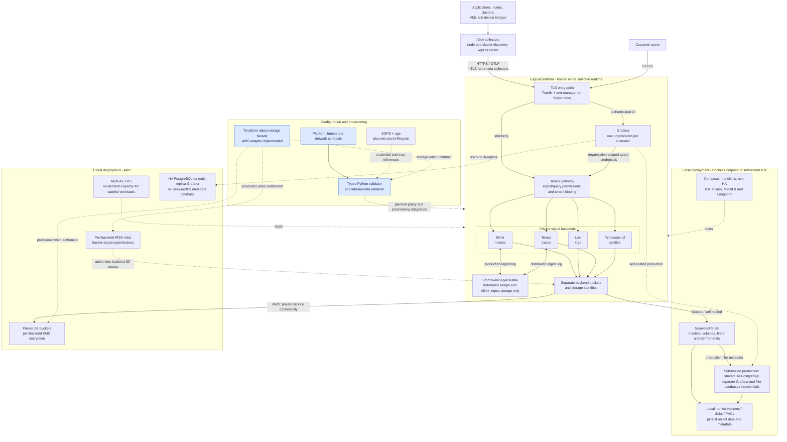
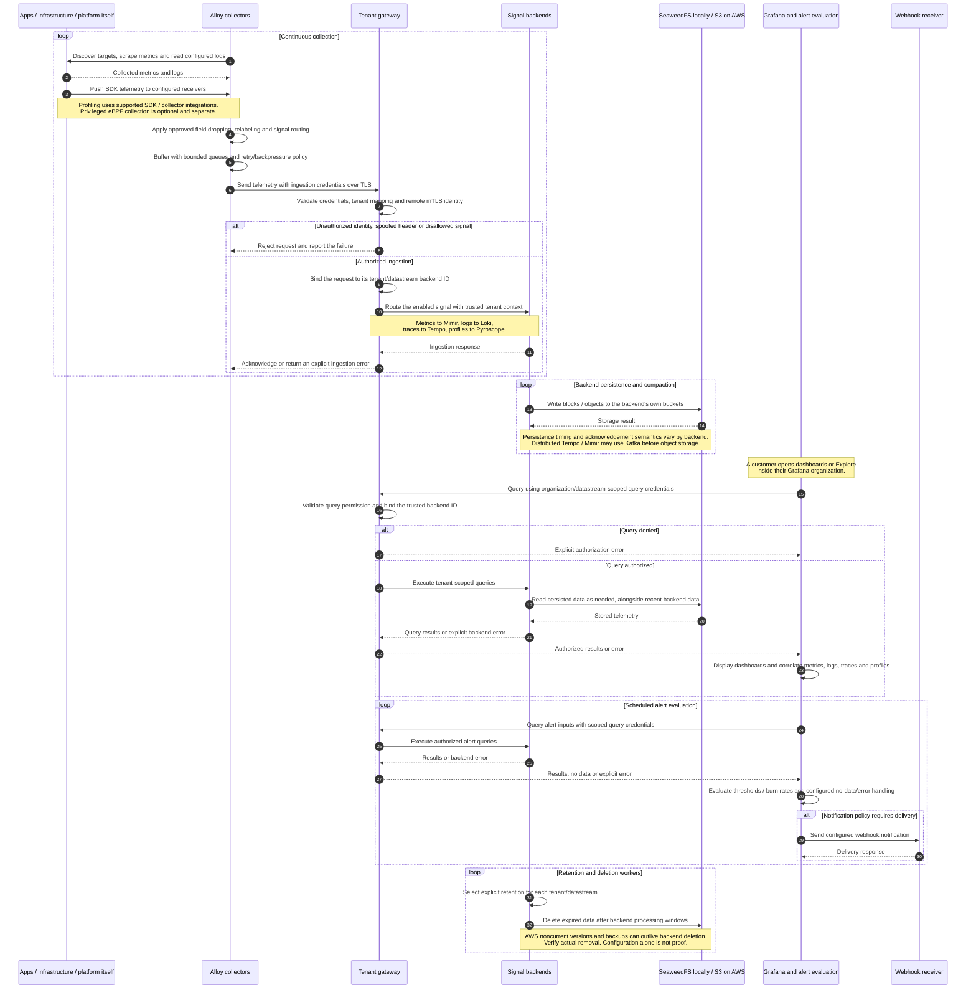

# Architecture and monitoring diagrams

These diagrams describe NightHawk's **target architecture**, including the
approved SeaweedFS and AWS storage decisions. They do not represent a deployed
platform.

The configuration validator/intermediate renderer, Pyroscope retention fragment,
and AWS storage Terraform modules are implemented and locally tested.
Runtime collection, gateway enforcement, dashboards, alerting, and full deployment
automation remain planned.

## 1. Platform architecture

The same logical observability services run in **one selected deployment
profile**. Local deployments use SeaweedFS backed by local disks/PVCs; AWS
deployments use S3. These are alternatives, not a storage replication chain.

**Reading the diagram**

- Blue nodes identify implemented configuration/module code, not deployed
  infrastructure. Dotted arrows show hosting, provisioning, or configuration
  relationships; solid arrows show application or storage paths.
- The gateway selects a stable backend tenant ID for each authorized
  customer/datastream pair. Clients cannot choose arbitrary tenant IDs.
- Raw backend endpoints and storage remain private. Kubernetes uses
  default-deny NetworkPolicies with explicit allowances.
- Compose is Kafka-free. Kafka is part of the selected distributed Kubernetes
  backend architectures, not a dependency of Loki or Pyroscope.
- The self-hosted HA PostgreSQL cluster is shared to reduce resource usage.
  Separate databases and credentials do not eliminate its shared failure domain.
- The diagram omits the separately protected Terraform state/bootstrap store.
  It is not a telemetry bucket and must not be included in ordinary teardown.

## 2. How monitoring works

This sequence follows telemetry from collection through tenant-aware ingestion,
storage, investigation, and alert delivery. `Signal backends` represents Mimir,
Loki, Tempo, and Pyroscope; their internal distributed components are condensed.

**Important monitoring details**

1. **Collection is not only scraping.** Metrics can be scraped, SDK telemetry can
   be pushed, logs need configured readers/receivers, and profiles need supported
   instrumentation or profiling collectors.
2. **Isolation applies to writes and reads.** Ingestion-only credentials cannot
   query data. Grafana organizations have datastream-specific data sources and
   cannot enable cross-customer queries through client-supplied headers.
3. **Redaction is a processing requirement, not a guarantee shown by an arrow.**
   Supported transformations must be tested with sensitive fixtures; profiling
   payload sanitization has additional limits.
4. **Alerts need an external destination.** Development uses a test webhook
   receiver; production requires a real configured destination. An optional
   external dead-man monitor covers failures of the shared monitoring platform.
5. **The platform monitors itself.** Collectors, gateway, backends, Kafka,
   databases, and storage must expose operational signals through the same
   collection design. External failure detection remains important.

See [architecture decisions](01-architecture.md) and
[implemented configuration tooling](02-configuration.md) for details and
current implementation boundaries.
